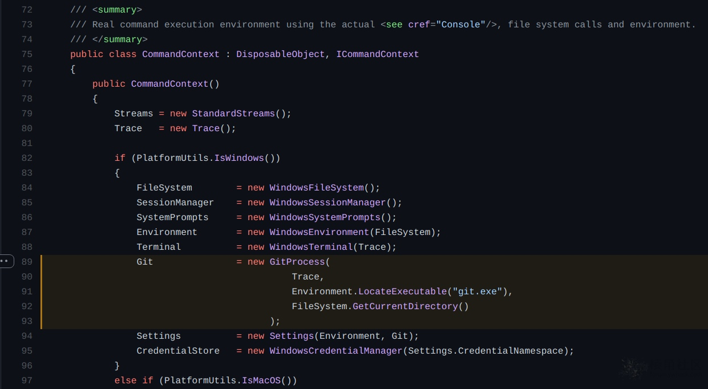
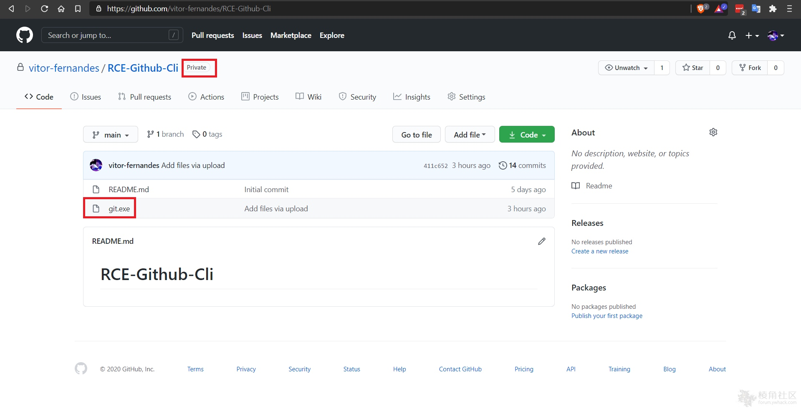
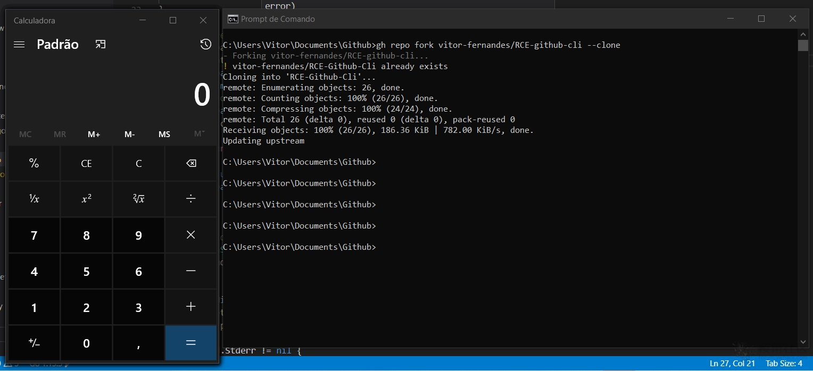

# Git CLI远程代码执行漏洞（CVE-2020-26233）

src/shared/Microsoft.Git.CredentialManager/CommandContext.cs的代码：

第89行中，将创建一个搜索git.exe的新进程，并将Environment.LocateExecutable('git.exe')作为目录路径参数传递给GitProcess()函数。

**利用步骤：**

* a）创建一个新的存储库或将文件添加到现有存储库；
* b）将Windows可执行文件上传到此存储库，重命名为git.exe；
* c）等待受害者fork存储库

使用gh repo fork REPOSITORY_NAME --clone frok后触发rce：

ref：

* https://github.com/microsoft/Git-Credential-Manager-Core/security/advisories/GHSA-2gq7-ww4j-3m76
* https://wildfire.blazeinfosec.com/attack-of-the-clones-2-git-command-client-remote-code-execution-strikes-back/
* https://github.com/microsoft/Git-Credential-Manager-Core/blob/c3a543a1352dba953e027f7a92ee4a94b2293a22/src/shared/Microsoft.Git.CredentialManager/CommandContext.cs#L89-L93
* https://forum.ywhack.com/thread-115014-1-1.html