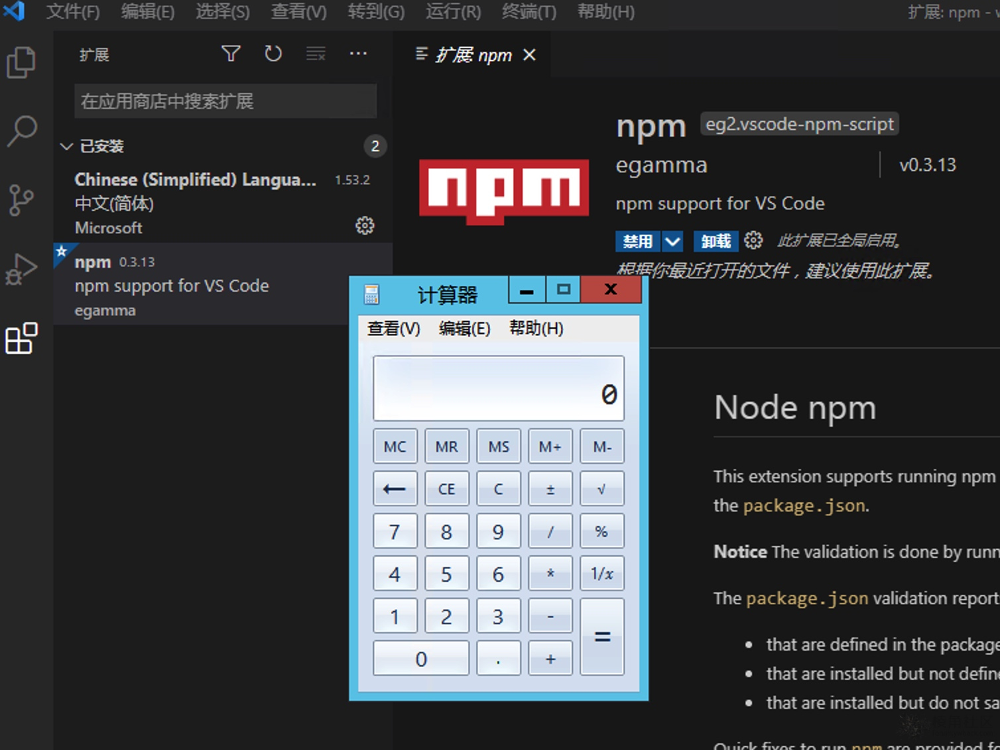

# NPM VSCode扩展中的RCE（CVE-2021-26700）

VSCode扩展eg2.vscode-npm-script中的远程代码执行漏洞，查看.vscode/settings.json文件时，项目中的恶意Payload可能导致远程代码执行。

测试版本：0.3.13

* 攻击者发布存储库，例如附加的linux-poc
* 目标克隆存储库以读取VSCode中的源代码
* 目标视图 package.json
* payload.sh 被执行

PoC：

https://github.com/jackadamson/CVE-2021-26700