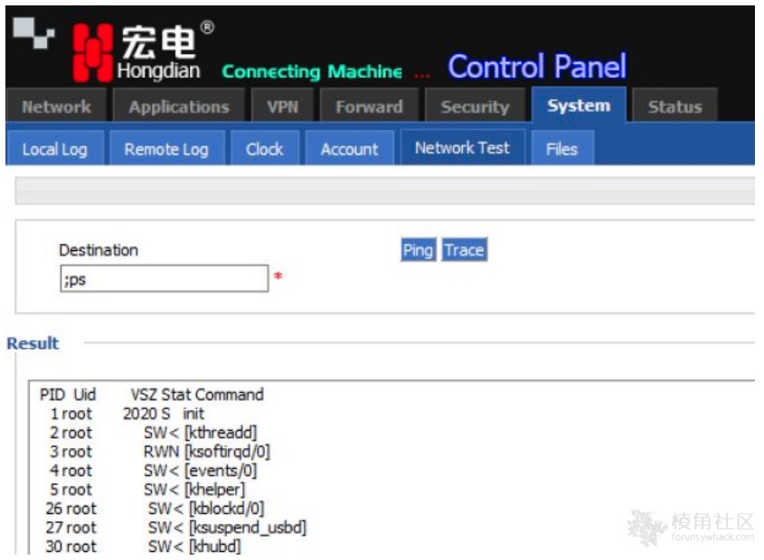

# 宏电 H8922 路由器中多个漏洞（CVE-2021-28149~52）

宏电 H8922设备中的几个漏洞可以让远程攻击者使用root权限让设备执行任意命令，导致的原因是因为用户提供的数据没有得到过滤，并且存在后门帐户允许通过端口5188/tcp进行访问。

CVE编号：CVE-2021-28149，CVE-2021-28150，CVE-2021-28151，CVE-2021-28152

影响版本：

宏电 8922 3.0.5

1.隐藏后门

可以使用隐藏的用户默认账号密码进行连接5188端口以获得root权限。

root:superzxmn

2.命令注入

System - Network Test（/tools.cgi）模块下可以使用最小特权（来宾）用户通过替换命令结束字符以超级用户（root）的身份执行系统任意命令。




3.路径遍历

日志导出功能(/log_download.cgi)由于未验证用户输入，导致路径遍历漏洞，可以以最小的权限用户从设备下载任意文件。

PoC：

```
http://[ip]/log_download.cgi?type=../../etc/passwd
```

ref：

https://ssd-disclosure.com/ssd-advisory-hongdian-h8922-multiple-vulnerabilities/